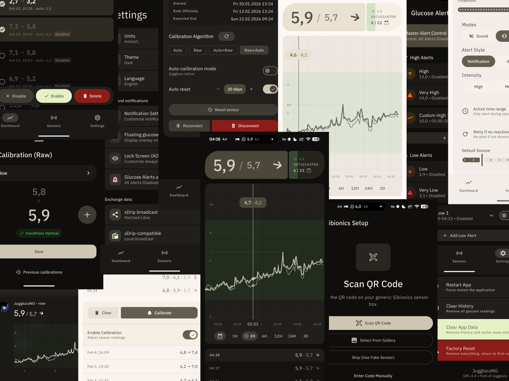

# JugglucoNG

A continuous glucose monitoring app for Android, rebuilt on Material 3. JugglucoNG is a fork of [Juggluco](https://github.com/j-kaltes/Juggluco) by Jaap Korthals Altes that keeps Juggluco's native sensor engine and wraps it in a modern Compose UI, a sensor-independent database, and a much larger feature set: multi-sensor support, a treatment journal with IOB/COB, predictive simulation, a rewritten alarm engine, and Nightscout in both directions.



**Latest release: [1.0.9-Alpha](https://github.com/ctqvva/JugglucoNG/releases)**. This is alpha software: expect rough edges, and never make treatment decisions based on this app alone.

## Supported sensors

- Abbott FreeStyle Libre 2 / 2+ / 3 / 3+
- Dexcom G7 / ONE+
- Sibionics GS1
- Accu-Chek SmartGuide
- CareSens Air
- Aidex X
- Ottai
- GlucoRx Anytime CT4 / CT5
- iCan i3 (Sinocare)
- MQ / Glutec
- Nightscout follower (use another uploader as your data source)

Multiple sensors can run at the same time. An opt-in handover mode starts the next sensor automatically when the current one reaches its official expiry. Bluetooth fingerstick meters can log readings straight into the journal.

## Features

**Glucose display.** Material 3 dashboard with trend arrow, delta, and reading history; statistics (time in range, GMI, AGP percentile views, exportable reports) with persistent time ranges; charts in the notification shade; always-on display; floating overlay; home-screen widgets; automatic dark mode.

**Alarms.** Custom alarm engine: low/high with time ranges and episodes, rate-of-change alarms (falling/rising fast), sensor-expiry warnings at configurable thresholds, signal-loss and forecast alerts, follower alerts. Alarms can be spoken (TTS), delayed, or vibrate-first, and a failed delivery does not silently consume the alarm.

**Journal and insulin.** Food database with meal curves, dose calculator, insulin-on-board (IOB/eIOB) and carbs-on-board (COB) tracking, treatment intake from AAPS, treatment sync with Nightscout, quick-add entries.

**Prediction.** On-device predictive simulation of glucose, insulin, and meals, with configurable model profiles.

**Nightscout.** Upload readings and treatments, follow a remote site, and exchange IOB/eIOB/COB through devicestatus in both roles (opt-in). Long-acting insulin entries are supported.

**Data.** Sensor-independent local database with export/import, direct import of Juggluco's TSV export, settings export, and non-destructive calibration exports. Per-sensor calibration models with chart and table views.

**Sharing and integrations.** Mirror the app to another phone over LAN or the internet (ICE/TURN, no account needed); `glucodata`-style broadcasts for other apps and watchfaces; Health Connect; Pebble; an [outbound API](docs/outbound-api.md) that pushes readings to Telegram, VK, or any webhook.

## Building

Requirements: JDK 21, Android SDK with NDK and CMake, and the libjuice submodule:

```
git submodule update --init
./gradlew assembleMobileLibre3SiDexGoogleDebug
```

Some product flavors depend on proprietary vendor libraries (Libre 3, Sibionics) that are not part of this repository; the corresponding variants need those `jniLibs` supplied separately. Unit tests run with `./gradlew :Common:testMobileLibre3SiDexGoogleDebugUnitTest`.

## Version history

See the [Releases page](https://github.com/ctqvva/JugglucoNG/releases) for the changelog of each Alpha build.

## License and credits

GPL-3.0 (see [LICENSE.txt](LICENSE.txt)). Based on [Juggluco](https://github.com/j-kaltes/Juggluco) by Jaap Korthals Altes, whose native sensor engine this project builds on. JugglucoNG is developed by [ctqvva](https://github.com/ctqvva) with contributions from the community.

**Disclaimer:** this software is experimental and comes with no warranty of any kind. It is not a medical device. Always confirm readings with an approved device before acting on them.
